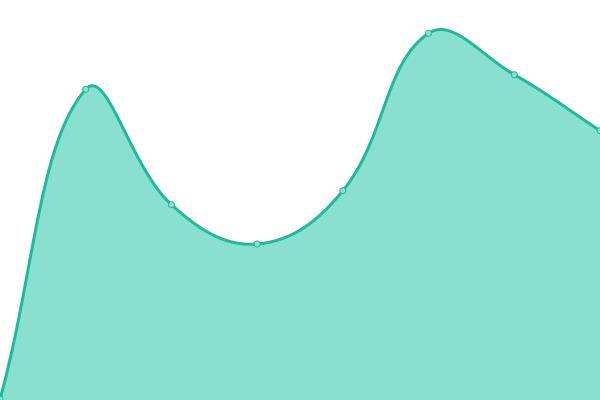
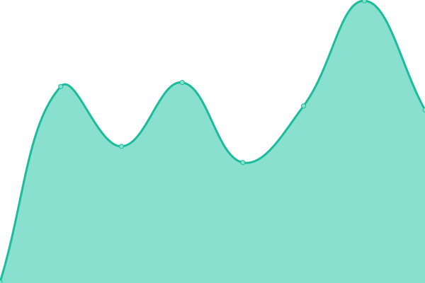

# [📈 Live Status](https://demo.upptime.js.org): <!--live status--> **🟩 All systems operational**

This repository contains the open-source uptime monitor and status page for [Upptime](https://upptime.js.org), powered by [Upptime](https://github.com/upptime/upptime).

With [Upptime](https://upptime.js.org), you can get your own unlimited and free uptime monitor and status page, powered entirely by a GitHub repository. We use [Issues](https://github.com/upptime/upptime/issues) as incident reports, [Actions](https://github.com/ryujishibuya/website-status-by-Upptime/actions) as uptime monitors, and [Pages](https://demo.upptime.js.org) for the status page.

<!--start: status pages-->
<!-- This summary is generated by Upptime (https://github.com/upptime/upptime) -->
<!-- Do not edit this manually, your changes will be overwritten -->
<!-- prettier-ignore -->
| URL | Status | History | Response Time | Uptime |
| --- | ------ | ------- | ------------- | ------ |
|  Secret Site 1 | 🟩 Up | [secret-site-1.yml](https://github.com/RyujiShibuya/website-status-by-Upptime/commits/HEAD/history/secret-site-1.yml) | 

 952ms
     
 | 

<a href="https://ryujishibuya.github.io/website-status-by-Upptime/history/secret-site-1">100.00%</a>
    

|  [KOKUSAI Taro's Site(Home)](https://sites.google.com/gl.aiu.ac.jp/kokusaitarostestsite/home) | 🟩 Up | [kokusai-taro-s-site-home.yml](https://github.com/RyujiShibuya/website-status-by-Upptime/commits/HEAD/history/kokusai-taro-s-site-home.yml) | 

 498ms
     
 | 

<a href="https://ryujishibuya.github.io/website-status-by-Upptime/history/kokusai-taro-s-site-home">100.00%</a>
    

|  [KOKUSAI Taro's Site(Sub1)](https://sites.google.com/gl.aiu.ac.jp/kokusaitarostestsite/home/sub1) | 🟩 Up | [kokusai-taro-s-site-sub1.yml](https://github.com/RyujiShibuya/website-status-by-Upptime/commits/HEAD/history/kokusai-taro-s-site-sub1.yml) | 

 297ms
     
 | 

<a href="https://ryujishibuya.github.io/website-status-by-Upptime/history/kokusai-taro-s-site-sub1">100.00%</a>
    

<!--end: status pages-->

[**Visit our status website →**](https://demo.upptime.js.org)

## 📄 License

- Powered by: [Upptime](https://github.com/upptime/upptime)
- Code: [MIT](./LICENSE) © [Upptime](https://upptime.js.org)
- Data in the `./history` directory: [Open Database License](https://opendatacommons.org/licenses/odbl/1-0/)
